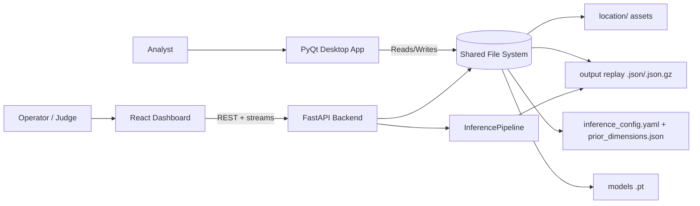
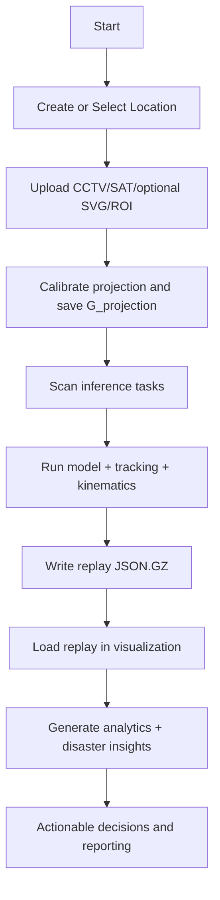
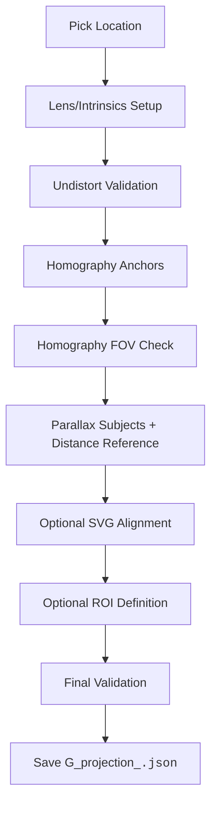
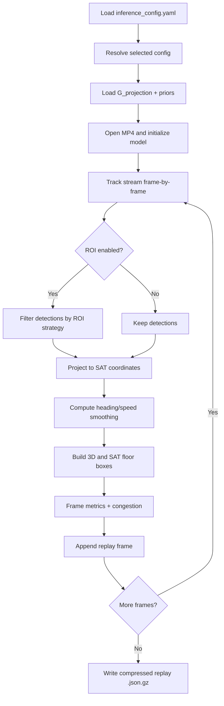

# TrafficLab 3D

AI-powered traffic digital twin for smart city planning, incident response, and junction optimization.

TrafficLab 3D turns plain CCTV footage into a synchronized dual-view simulation:

- CCTV view with tracking, 3D box projection, and analysis overlays
- Satellite view with projected motion, floor boxes, and traffic context
- Actionable analytics for congestion, incidents, and disaster rerouting

This repository contains both:

- A desktop calibration + inference + visualization suite (PyQt)
- A web dashboard + FastAPI backend for modern browser-based operations

---

## Table of Contents

1. [Overview](#overview)
2. [Core Features](#core-features)
3. [System Architecture](#system-architecture)
4. [Flowcharts](#flowcharts)
5. [Tech Stack](#tech-stack)
6. [Repository Structure](#repository-structure)
7. [Quick Start](#quick-start)
8. [Run Modes](#run-modes)
9. [API Reference](#api-reference)
10. [Troubleshooting](#troubleshooting)
11. [Roadmap](#roadmap)

---

## Overview

**Core pipeline:**

1. Prepare location assets (CCTV image, satellite image, optional SVG/ROI)
2. Calibrate geometry to create `G_projection`
3. Run inference + tracking on MP4 footage
4. Save compressed replay outputs (`.json.gz`)
5. Stream visualization and analytics from the API

---

## Core Features

### Calibration

- Multi-stage calibration flow for robust CCTV-to-SAT projection.
- Optional SVG alignment and ROI masking.
- Generates reusable location projection JSON.

### Inference

- YOLO-based object detection and ByteTrack-style tracking workflow.
- Config-driven model/tracker/kinematics tuning via YAML.
- Compressed replay generation for storage and fast loading.

### Visualization

- CCTV stream overlays (3D boxes, labels, heatmap, incidents, recommendations).
- Satellite stream overlays (SAT boxes/arrows/labels, layer toggles, FOV modes).
- Synchronized replay behavior designed for digital twin demonstration.

### Analytics and Decision Support

- Timeline KPIs (speed, congestion, risk).
- Hotspot extraction and class distributions.
- Disaster-management aggregate with rerouting and playbook-style outputs.

### Frontend Experience

- Landing page + dashboard navigation.
- Dedicated pages for core pipeline and advanced analysis modules.

---

## System Architecture

The project has two operator-facing experiences:

- Desktop app: deep calibration and local operations
- Web app: API-driven dashboard and remote-friendly workflows

Both use a common data layer (`location/`, `output/`, configs, models).



---

## Flowcharts

### 1) End-to-End Product Flow



### 2) Calibration Stage Flow



### 3) Inference Execution Flow



### 4) Web Visualization and Analytics Flow

```mermaid
flowchart LR
    V0[Dashboard selects replay path] --> V1[/api/visualization/data]
    V0 --> V2[/api/visualization/stream/cctv]
    V0 --> V3[/api/visualization/stream/sat]
    V0 --> V4[/api/visualization/analytics]
    V0 --> V5[/api/visualization/disaster-management]

    V1 --> R[(Replay Cache)]
    V2 --> R
    V3 --> R
    V4 --> R
    V5 --> R

    V2 --> OV1[CCTV overlays]
    V3 --> OV2[SAT overlays]
    V4 --> KP[KPI and timeline output]
    V5 --> DM[Risk zones + rerouting + playbook]
```

## Tech Stack

### Backend and AI

- Python 3.10 (recommended via `environment.yml`)
- FastAPI + Uvicorn
- OpenCV, NumPy
- PyTorch + Ultralytics YOLO
- YAML/JSON based configuration

### Frontend

- React 18 + Vite
- React Router
- Chart.js + react-chartjs-2
- TensorFlow.js (analysis modules)
- lucide-react icons

### Desktop

- PyQt5
- qdarktheme

---

## Repository Structure

```text
Dexter-bmscehack/
├── api/                        # FastAPI server and route handlers
├── location/                   # Per-location assets and footage
├── models/                     # YOLO model weights
├── modules/                    # Heatmap/incidents/recommendation logic
├── output/                     # Inference replay outputs
├── trafficlab/                 # Core desktop application and pipeline modules
├── web/                        # React + Vite frontend
├── environment.yml             # Main Python environment spec
├── inference_config.yaml       # Inference profiles
├── prior_dimensions.json       # Class dimension priors
├── main.py                     # Desktop app entrypoint
└── start_web.py                # One-command web launcher
```

---

## Data Contracts

**Location folder:**

```text
location/<CODE>/ → cctv_<CODE>.png, sat_<CODE>.png, G_projection_<CODE>.json, footage/*.mp4
```

**Output replay:**

```text
output/model-<model>_tracker-<tracker>/<config>/<CODE>/*.json.gz
```

---

## Quick Start

### Prerequisites

- Python 3.10+ (3.10 recommended)
- Node.js 18+ and npm
- Git
- Windows/Linux/macOS with OpenCV-compatible environment

### Setup Option A (recommended): Conda

```bash
conda env create -f environment.yml
conda activate cctv_test
```

### Setup Option B: Existing virtual environment

If you already maintain `.venv`, ensure all required AI + API dependencies are installed.

API-only minimum requirements file is available:

```bash
pip install -r api/requirements.txt
```

### Frontend setup

```bash
cd web
npm install
```

---

## Run Modes

### 1) One-command web stack

Starts backend + frontend together:

```bash
python start_web.py
```

Expected endpoints:

- Frontend: http://localhost:5173
- API: http://localhost:8000
- API docs: http://localhost:8000/docs

### 2) Manual split mode

Backend:

```bash
python -m uvicorn api.main:app --host 0.0.0.0 --port 8000 --reload
```

Frontend:

```bash
cd web
npm run dev
```

### 3) Desktop app mode

```bash
python main.py
```

Note on Windows:
`main.py` preloads Torch before Qt startup to avoid DLL initialization issues on some systems.

### 4) Production frontend build and preview

```bash
cd web
npm run build
npm run preview
```

Use this mode to validate production asset paths before deployment.

---

---

## API Reference

Base URL: `http://localhost:8000`

### Health

- `GET /api/health` - service health and version

### Config

- `GET /api/config` - fetch raw YAML and config names
- `PUT /api/config` - save raw YAML content
- `GET /api/config/measurements` - fetch class dimension priors
- `PUT /api/config/measurements` - save priors JSON

### Locations

- `GET /api/locations` - list all locations and available assets
- `GET /api/locations/{code}` - detailed location info + footage metadata
- `POST /api/locations` - create location with required uploads
- `POST /api/locations/{code}/footage` - upload one MP4
- `POST /api/locations/{code}/footage/batch` - upload many MP4 files
- `POST /api/locations/{code}/g_projection` - upload projection JSON
- `GET /api/locations/{code}/g_projection` - fetch projection JSON
- `PUT /api/locations/{code}/g_projection` - overwrite projection JSON

### Inference

- `GET /api/inference/scan` - inspect tasks and statuses
- `POST /api/inference/start` - launch threaded batch inference
- `POST /api/inference/stop` - request stop
- `GET /api/inference/status` - check running/progress state
- `GET /api/inference/progress` - SSE stream for logs/progress
- `DELETE /api/inference/wipe` - delete output for selected config

#### Sample start payload

```json
{
  "config_name": "mild_smoothing",
  "tasks": [
    {
      "loc": "119NH",
      "mp4_path": "location/119NH/footage/example.mp4",
      "g_proj": "location/119NH/G_projection_119NH.json"
    }
  ]
}
```

### Visualization

- `GET /api/visualization/files` - list replay files
- `GET /api/visualization/data?path=...` - replay metadata summary
- `GET /api/visualization/analytics?path=...&sample_step=5` - KPI/timeline analytics
- `GET /api/visualization/disaster-management?path=...&sample_step=5` - integrated disaster output
- `GET /api/visualization/stream?path=...` - compatibility CCTV stream endpoint
- `GET /api/visualization/stream/cctv?path=...` - CCTV MJPEG stream with overlays
- `GET /api/visualization/stream/sat?path=...` - SAT MJPEG stream with layer controls

---

---

---

---

## Troubleshooting

### Frontend build/start issues

- Ensure `npm install` has been run in `web/`.
- Use Node.js 18+.
- Confirm Vite dev server and API proxy ports (5173 and 8000).

### API not reachable

- Verify backend command and active port.
- Open `http://localhost:8000/api/health` and `http://localhost:8000/docs`.

### No output files after inference

- Confirm location has valid `G_projection` and MP4 footage.
- Check `GET /api/inference/scan` task statuses.
- Monitor `GET /api/inference/progress` stream for runtime errors.

### Desktop startup issues on Windows

- Keep Torch import before Qt app creation path (already handled in `main.py`).

### Path errors while loading visualization files

- Always use paths returned by `GET /api/visualization/files`.

---

## Roadmap

- Multi-camera fusion for larger corridor coverage
- Short-term trajectory forecasting and ETA-aware control suggestions
- Signal optimization loops with what-if simulations
- Role-based auth and operations audit trail
- Cloud deployment templates and CI/CD pipelines

---

## Conclusion

TrafficLab 3D provides a complete, production-ready traffic operations platform that bridges the gap between raw CCTV footage and actionable intelligence. By combining calibration tooling, efficient inference pipelines, and real-time analytics, the system enables rapid deployment to new locations without expensive specialized hardware or training.

The dual-interface design—desktop for setup and analysis, web for operations—ensures accessibility across different user roles and deployment scenarios. The offline-first replay architecture and comprehensive API make it suitable for both live monitoring and post-incident analysis.

Whether you're running a single junction or managing a city-scale traffic network, TrafficLab 3D provides the geometric precision, tracking accuracy, and analytical depth needed to make informed operational decisions and measure impact.
